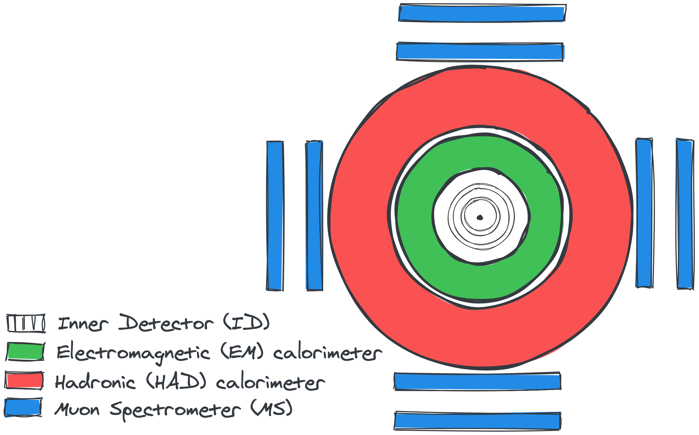

- [Introduction](#introduction)
- [Hunting Supersymmetry in events with large jet multiplicities](#hunting-supersymmetry-in-events-with-large-jet-multiplicities)

## Introduction

<figure class="image" style="float: right; padding-top: 2%;">
  
  <figcaption align="center" style="font-style: italic; display: block; margin-left: auto; margin-right: auto;padding-top: 3%; padding-bottom: 3%;" alt="DMContent">Figure 1: Current content of the universe.</figcaption>
  <!-- https://map.gsfc.nasa.gov/media/080998/index.html -->
</figure>
What are we made of? How was the universe created and which features of nature
allowed stars, planets and life to exist today? These are only some of the
fundamental questions that have fascinated humans for centuries, and only
partial answers to these have been found today. Particle Physics provides a
remarkable description of the atomic and subatomic world that, going back in time
to the Big Bang, allows to explain many features of the current cosmological
observations.  However, not all features of nature are currently understood. 
Some open questions of physics are:

* The origin of dark matter, an unknown type of matter composing ~23% of the
  mass of our universe.
* The matter-antimatter asymmetry of the universe.
* The unification of electroweak, strong and gravity forces.

One way to test our explanations to these questions is through dedicated physics
experiments. A particular category are collider experiments, allowing to probe
the existence of new phenomena at high energy. 

<!-- ## The ATLAS detector at the Large Hadron Collider (LHC) -->
<figure class="image" style="float: left; padding-top: 3%; padding-bottom: 2% ;padding-right: 3%;">
  
  <figcaption align="center" style="font-style: italic; display: block; margin-left: auto; margin-right; padding-top: 3%; padding-bottom: 3%;" alt="SectionViewATLAS">Figure 1: Section view of the ATLAS experiment at CERN.</figcaption>
</figure>

My research focuses on the colliders domain, in particular on the measurements carried
out by the [ATLAS experiment](https://atlas.cern), a multi-purpose physics detector
composed today by a collaboration of more than 3000 scientists and 181
institutions distributed around the world.
This machine, records the outcome of the collisions provided every 25 ns by the [Large 
Hadron Collider (LHC)](https://home.cern/science/accelerators/large-hadron-collider), a 27 km long proton-proton (pp) collider located at the 
[European Organization for Nuclear Research (CERN)](https://home.cern) facility, near 
Geneva (Switzerland).
The detector is composed of:

1. An *Inner Detector* (ID) allowing to reconstruct tracks left by charged
   particles passing through the detectors.
2. A *Calorimeter system*, composed of an Electromagnetic (EM) and a Hadronic
   (HAD) calorimeter, stopping both neutral and charged particles and allowing
   to measure their energies.
3. A *Muon Spectrometer* (MS) allowing to reconstruct tracks left by muons passing
   through the calorimeter system without being stopped.

<!-- ## Particle Flow: Combining sub-detector informations for better reconstruction precision
<figure class="image" style="float: right;">
  
  <figcaption align="center" style="font-style: italic;" alt="ATLASPFlow">Figure 1: An event with 19 jets recorded by ATLAS on 18 July 2018.</figcaption>
</figure> -->

## Hunting Supersymmetry in events with large jet multiplicities
<figure class="image" style="float: right;">
  
  <figcaption align="center" style="font-style: italic;" alt="PFLowSUSY">Figure 1: An event with 19 jets recorded by ATLAS on 18 July 2018.</figcaption>
</figure>
Supersymmetry (SUSY) is one of the most appealing extensions of the Standard Model (SM),
predicting the existence of a new hidden particle sector through the
introduction of a fermion-boson symmetry. This theory offers an answer to many of the
current open questions of physics, such as the origin of dark matter and the unification
of elementary forces at high energy. SUSY particles could manifest themselves in
different ways in the proton-proton (p-p) collisions of the Large Hadron
Collider (LHC). 

During the second Run of the LHC (2015-2018) I had the opportunity
